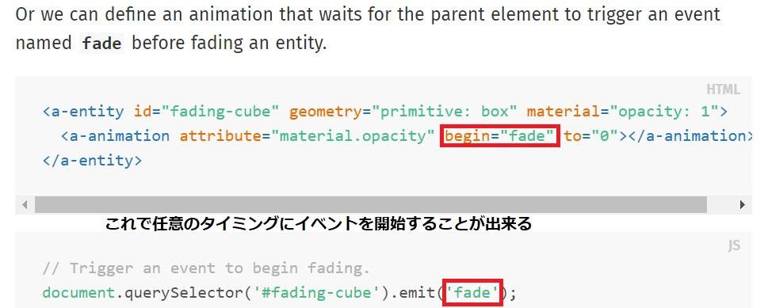

# 概要

2018-08-22:開発開始のVRLPレポジトリ

**カメラが動き始めるところから、文字が出てくるところまで実装してある。**

一旦ここでおいておいて、別レポジトリで続きを作成し、後で繋げる。


# gh-pagesとGitLFS

- gh-pagesはGitLFSにあるファイルをロードしません。
  https://github.com/git-lfs/git-lfs/issues/791

- 100MB超のファイルをpushしようとするとGitHubはエラーになります。

- GitLFSを使わず、100MB内で作らないとgh-pagesは使えません。

# A Frameはローカルではいかない

これまで数回に渡ってA-FRAMEを使ったVR開発を行ってきました。

しかし、リソース（画像ファイル、音楽ファイルなど）読み込む必要があるプログラムはローカル環境では動作させることができません。

http://roman-tech.hatenablog.jp/entry/2016/07/14/000633

# 重要

```JavaScript
document.querySelector('#id');
```
index.html内のidエンティティを取得できる

```JavaScript
element.setAttribute(name,value);
star_text.setAttribute('position', ' 0 0 '+z+' ');
vc.setAttribute('opacity', opacity);
```
指定の要素に存在する属性の値を変更する

文字列内で変数を使う時は、プラスとクオーテーションで囲んであげる

```JavaScript
entityEl.parentNode.removeChild(entityEl);
```
これでentityEl(DOM)を削除出来る

fuseとは、一定時間対象にカーソルを乗せるとクリックが発生する機能です。

デフォルトでは使えませんが、a-cursorのfuseプロパティをonにすることで有効にできます。



## font変更
```
      <a-text value="VR CAMP" font="V-GERB(bold)-msdf.json" negate="false" scale="5 5 1" position="0 3.5 -6" align="center"></a-text>
```

これで行けた、[ここ](https://msdf-bmfont.donmccurdy.com/)でjson変換

### Templateコンポーネント

同じ構文をテンプレート化して、コードを簡潔にすることが出来る

```
<script src="https://unpkg.com/aframe-template-component@3.x.x/dist/aframe-template-component.min.js"></script>
```

```
<a-assets>
  <!-- ... -->
  <script id="plane" type="text/html">
    <a-entity class="link"
      geometry="primitive: plane; height: 1; width: 1"
      material="shader: flat; src: ${thumb}"
      sound="on: click; src: #click-sound"></a-entity>
  </script>
</a-assets>

<!-- ... -->

<!-- Pass image sources to the template. -->
<a-entity template="src: #plane" data-thumb="#city-thumb"></a-entity>
<a-entity template="src: #plane" data-thumb="#cubes-thumb"></a-entity>
<a-entity template="src: #plane" data-thumb="#sechelt-thumb"></a-entity>
```

`${thumb}`でデータを渡すことが出来る。
